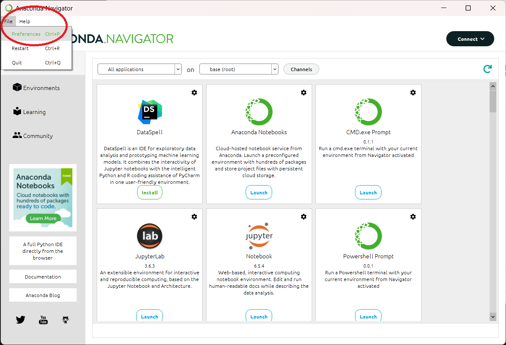
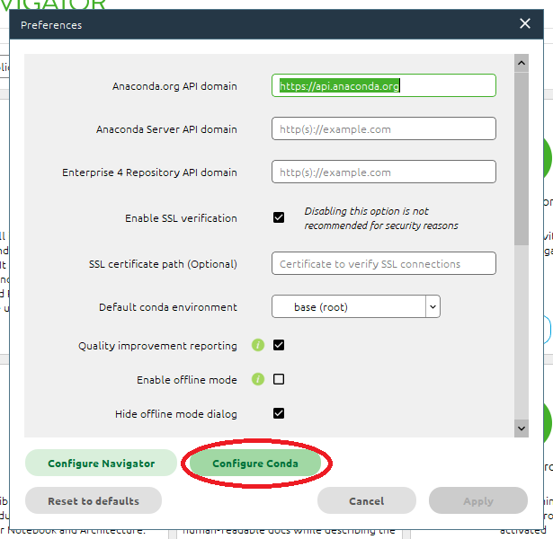
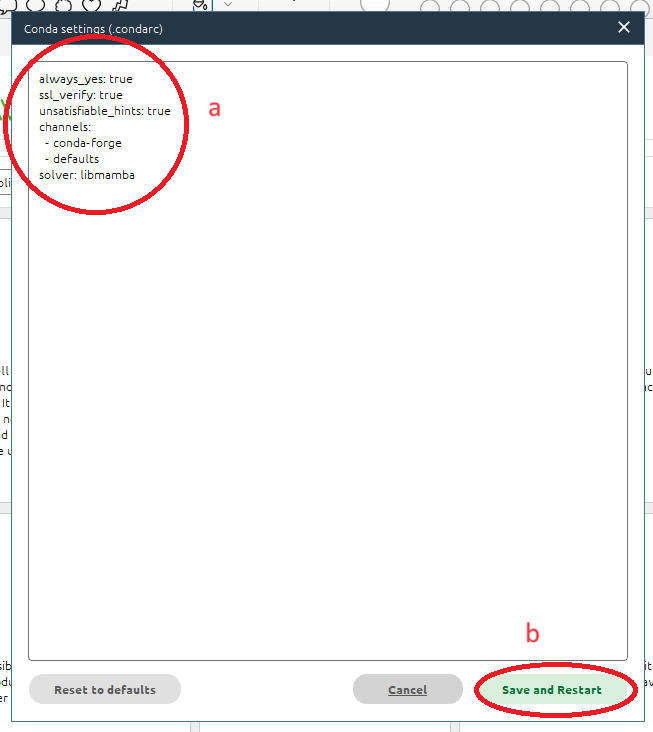
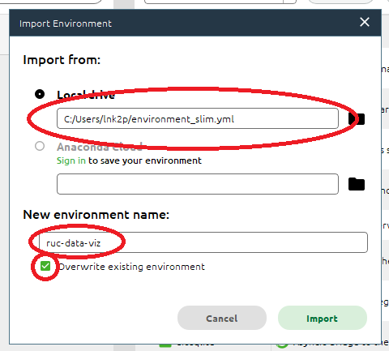

# viz-environment

This repository contains the necessary information and files needed to configure your own local development environment. There are a few different ways to handle setting things up.

## Cloud Environment

For those without their own device to bring to class, you will need to rely on cloud resources. While the primary resource will always be Codespaces, until access is restored we must turn to other resources.

### Anaconda Cloud

This is a free service for students with limited resources. While there is no direct `git` integration, you can still work entirely from this cloud. You must pay attention to your files and resources so as to not lose access to any work.

1. Sign up for an Anaconda account at [anaconda.cloud](https://anaconda.cloud/)
2. Sign in, and select `Launch Notebook` from the welcome screen at [anaconda.cloud](https://anaconda.cloud/)
3. You can now upload files, notebooks, and more to work on here. You are responsible for downloading completed work and submitting to GitHub; using GitHub Desktop (installation detailed below) will be very useful here.

Without configuring a new environment *you are not able to install new packages*. This is OK for now, but moving forward we will address this as needed. Do not attempt any `pip install` commands.

### Google Colab (Not Recommended)

Similar to Anaconda Cloud, [`Google Colab`](https://research.google.com/colaboratory/) is a notebook environment provided by Google. While extremely useful in some ways, working on a collection of files along with data files is not easy to configure within Colab. For this reason, Colab should only be reserved as a backup, and for when you only need to work on isolated files. In a pinch it can be useful though!

## Local Environment

### Install Anaconda

1. Download and install [Anaconda](https://www.anaconda.com/download).
    * This download is ~1Gb and is an installer of the Anaconda Python distribution, which includes Python, tons of packages, and tools for working with your code and data.
    * The default installation options are ok.
2. Launch the `Anaconda Navigator` tool that was installed by Anaconda

#### Configuring Anaconda

1. From the `Anaconda Navigator` go to `File -> Preferences`



2. Select `Configure Conda`



3. Ensure that your configuration looks like the following, then `Save and Restart`:

```text
always_yes: true
ssl_verify: true
unsatisfiable_hints: true
channels:
  - conda-forge
  - defaults
solver: libmamba
```



#### Slim Environment Installation

1. Download the file [`environment_slim.yml`](./environment_slim.yml) from this repository 
2. From the left-hand panel select the `Environments` tab
3. From the bottom select `Import`; select your downloaded `environment_slim.yml`, set the name to `ruc-data-viz` and check the box to overwrite any existing environment



### GitHub Desktop

1. Log into GitHub in your web browser
2. Download and install [GitHub Desktop](https://desktop.github.com/)
3. Launch GitHub Desktop (this should open automatically after the installation)
4. Select `Sign into GitHub.com` and follow the prompts, the default settings should be sufficient
    * This should open a tab in your browser, which will redirect you back to GitHub Desktop
5. From the welcome page, there is an option to search for your repositories.
    * Find one of your repositories and clone it - the default location is sufficient unless you want to save it elsewhere.

Please refer to the [documentation here](https://docs.github.com/en/desktop) for help, and if you get stuck, please let me know.
    
### JupyterLab /  Jupyter Notebook

#### DO NOT ATTEMPT TO PIP INSTALL ANYTHING WITHIN ANACONDA, YOU WILL BREAK IT

1. Open `Anaconda Navigator`, and go to the `Home` tab
2. Launch `JupyterLab` OR `Jupyter Notebook` 
3. This wil open a window in your browser - navigate to the repository that was cloned and open the `.ipynb` files.
4. When you are done making changes to your files, use `GitHub Desktop` to submit your files back to GitHub

#### I REPEAT: DO NOT ATTEMPT TO PIP INSTALL ANYTHING WITHIN ANACONDA, YOU WILL BREAK IT

### VS Code

It is also recommended to install VS Code along side everything else, but the configuration is a little beyond the scope of this guide. Along with GitHub Desktop this is the best way to emulate a Codesapce.
